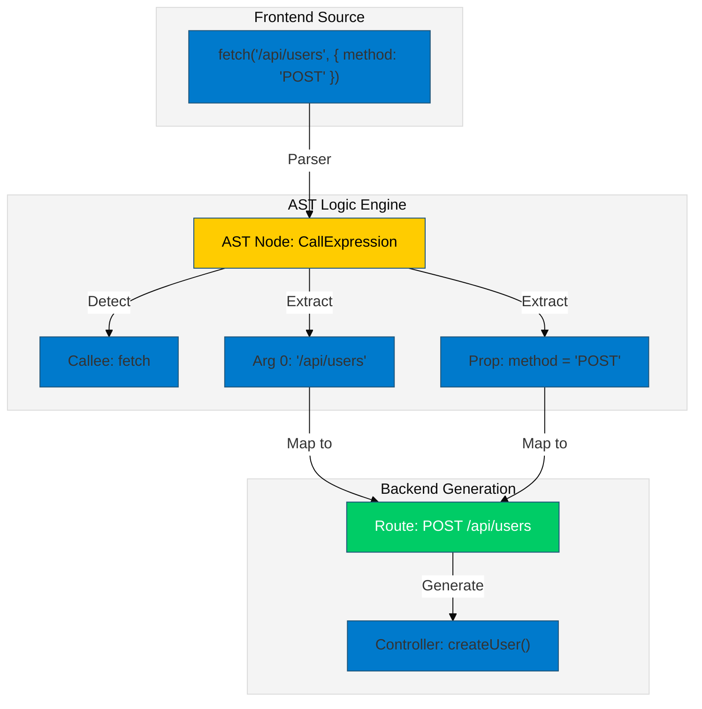

# 🚀 Create Backlist CLI

[](https://www.npmjs.com/package/create-backlist)
[](https://www.npmjs.com/package/create-backlist)
[](https://opensource.org/licenses/MIT)
[](https://github.com/WAH-ISHAN/create-backlist/graphs/commit-activity)

> **The World's First AST-Powered Polyglot Backend Generator.**

**`create-backlist`** is an intelligent CLI tool that **Reverse Engineers** your frontend source code to automatically generate production-ready backends.

Unlike traditional scaffolders that rely on static templates, it uses **Abstract Syntax Tree (AST) Analysis** to deep-scan your code (React, Vue, etc.), understand your API intent, and generate a custom backend in **Node.js, Python, Java, or C#** with full **Docker support**.

---

## 🧠 The Core Technology (AST Analysis)

Why is this tool unique? It doesn't just "read" text; it "understands" structure.

We use an **Abstract Syntax Tree (AST)** engine to break down your frontend code into its fundamental components. This allows us to ignore comments, spacing, and formatting, focusing purely on the logic.



---

## 🏗️ System Architecture

Our **3-Stage Compilation Process** ensures that one frontend codebase can generate backends in multiple languages.

```mermaid
graph LR
    subgraph Input [Stage 1: Analysis]
        A[Frontend Files] -->|AST Parsing| B(Scanner Engine)
    end
    subgraph Core [Stage 2: Abstraction]
        B -->|Extracts Endpoints| C{Intermediate JSON Bridge}
    end
    subgraph Output [Stage 3: Generation]
        C -->|Transpiles| D[Node.js (Express)]
        C -->|Transpiles| E[Python (FastAPI)]
        C -->|Transpiles| F[Java (Spring Boot)]
        C -->|Transpiles| G[C# (.NET Core)]
    end
    style C fill:#ff9900,stroke:#333,stroke-width:2px,color:white

```

1. **Stage 1 (Analysis):** The engine scans source files (prioritizing active editor context) to build an AST.
2. **Stage 2 (Abstraction):** Extracted logic is converted into a universal **JSON Intermediate Representation (IR)**. This acts as a "Bridge" between languages.
3. **Stage 3 (Generation):** Language-specific compilers read the JSON IR and write production-ready code.

---

## ⚡ Real-World Example

See how `create-backlist` transforms your code instantly.

### 1️⃣ Input (Your Frontend Code)

Imagine you have this simple API call in your React component:

```javascript
// user-profile.jsx
axios.post('/api/v1/users', { name: "Ishan", role: "Admin" });

```

### 2️⃣ Output (Generated Backend)

Running `npx create-backlist` automatically detects the route and body, generating:

```typescript
// Generated Controller (Node.js/Express)
import { Request, Response } from 'express';

export const createUsers = async (req: Request, res: Response) => {
    try {
        // Logic for POST /api/v1/users
        const { name, role } = req.body; 
        res.status(201).json({ message: "Resource created successfully" });
    } catch (error) {
        res.status(500).json({ error: "Internal Server Error" });
    }
};

```

*It also automatically updates `routes.ts` and creates a `Dockerfile`!*

---

## ✨ Key Features & Innovation

| Feature | Description |
| --- | --- |
| **🤖 AST-Powered Engine** | Uses advanced static analysis to detect endpoints dynamically. Superior to Regex because it understands code structure. |
| **🌐 Polyglot Support** | **One Tool, Four Stacks.** <br>

<br>✅ **Node.js** (Production Ready)<br>

<br>🚀 **Python, Java, C#** (Beta Support) |
| **🐳 Auto-Dockerization** | Instantly generates optimized `Dockerfile` and `docker-compose.yml` for zero-config deployment. |
| **🧠 Active Context Analysis** | Smartly prioritizes scanning the file currently open in your VS Code editor to capture complex endpoints missed by global scans. |
| **⚡ Zero-Config Boilerplate** | No manual setup. It scaffolds folders, installs dependencies (`package.json`, `pom.xml`, `requirements.txt`), and starts the server. |

---

## 📦 Installation & Usage

No global installation needed. Just run this command inside your existing frontend project's root:

```bash
npx create-backlist@latest

```

### 🚀 Interactive Walkthrough

The CLI will guide you through **3 Simple Steps**:

1. **Select Stack:** Choose between Node.js, Python, Java, or C#.
2. **Name Backend:** Choose a folder name (e.g., `my-server`).
3. **Locate Source:** Point to your frontend folder (e.g., `src`).

---

## 💡 Technical Comparison: Why AST?

Why did we choose Abstract Syntax Trees over simple Text Search (Regex)?

| Method | Can Read Comments? | Understands Variables? | Accuracy |
| --- | --- | --- | --- |
| **Regex (Others)** | ❌ No (Might detect commented code) | ❌ No | Low |
| **AST (Us)** | ✅ Yes (Ignores comments) | ✅ Yes (Trace variable values) | **High** |

---

## 🗺️ Roadmap & Research Goals

This tool is an ongoing research project aimed at automating software infrastructure.

* [x] **Phase 1: Core Engine** (AST Parsing & Node.js Support) - *Completed*
* [x] **Phase 2: Polyglot Architecture** (Python, Java, C# Support & Docker) - *Completed*
* [ ] **Phase 3: Intelligent Data Modeling** (Auto-generate Prisma/TypeORM schemas from request bodies)
* [ ] **Phase 4: Security Automation** (Auto-generate JWT auth and basic security headers)

---

## 🤝 Contributing & Feedback

This is an open-source project built for the developer community. We welcome contributions!

* Found a bug? [Open an Issue](https://github.com/WAH-ISHAN/create-backlist/issues).
* Want to contribute? [Submit a Pull Request](https://www.google.com/search?q=https://github.com/WAH-ISHAN/create-backlist/pulls).

Give us a ⭐ on GitHub if this saved you time!

---

*Built with ❤️ for builders by [W.A.H. ISHAN](https://github.com/WAH-ISHAN).*

```

---

