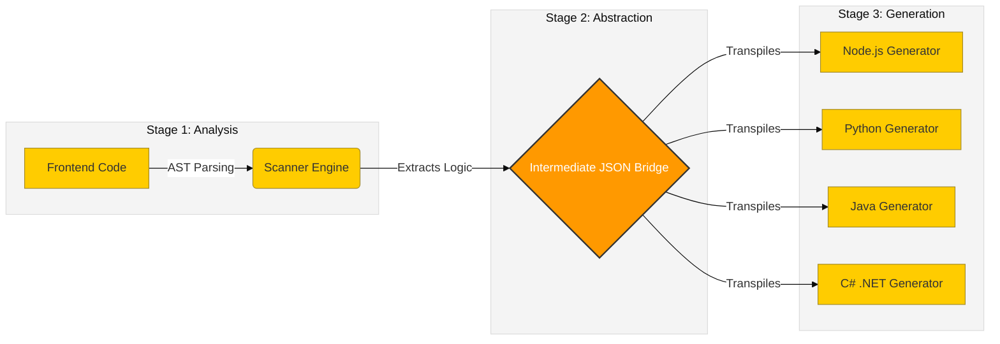

# 🚀 Create Backlist CLI

[](https://www.npmjs.com/package/create-backlist)
[](https://www.npmjs.com/package/create-backlist)
[](https://opensource.org/licenses/MIT)
[](https://github.com/WAH-ISHAN/create-backlist/graphs/commit-activity)

> **The World's First AST-Powered Polyglot Backend Generator.**

Tired of manually coding backend boilerplate? **`create-backlist`** is an intelligent CLI tool that **Reverse Engineers** your frontend code to automatically generate production-ready backends in seconds.

Unlike traditional scaffolders that use templates, it scans your live code (like `axios` or `fetch` calls) using **Abstract Syntax Trees (AST)** to build custom, context-aware backends with built-in **Docker support**.

---

## 🏗️ The Architecture (How It Works)

We don't just copy-paste. We use a sophisticated **3-Stage Compilation Process** to understand your code's logic. This allows us to support multiple languages from a single source.



1. **Stage 1 (Analysis):** The engine scans your frontend source code and builds an Abstract Syntax Tree to understand API intent.
2. **Stage 2 (Abstraction):** Extracted logic is converted into a universal **JSON Intermediate Representation (IR)** that acts as a "bridge" between languages.
3. **Stage 3 (Generation):** Language-specific code generators read the JSON IR and compile it into production-ready code for your chosen stack.

---

## ✨ Key Features & Innovation

| Feature | Description |
| --- | --- |
| **🤖 AST-Powered Engine** | Uses advanced static analysis to detect endpoints dynamically, not just regex matching. |
| **🌐 Polyglot Support** | One tool for multiple backend languages. <br>

<br>✅ **Node.js (Express/TS)** - *Production Ready*<br>

<br>🚀 **Python (FastAPI)** - *Beta Support*<br>

<br>☕ **Java (Spring Boot)** - *Beta Support*<br>

<br>🔷 **C# (ASP.NET Core)** - *Beta Support* |
| **🐳 Auto-Dockerization** | Instantly generates optimized `Dockerfile` and `docker-compose.yml` for zero-config deployment. |
| **🧠 Active Context Analysis** | Smartly prioritizes scanning the file currently open in your VS Code editor for higher accuracy on complex files. |
| **⚡ Zero-Config Boilerplate** | Generates controllers, routes, models, and configuration files automatically. |

---

## 📦 Installation & Usage

You don't need to install anything globally. Just go to your frontend project folder and run:

```bash
npx create-backlist@latest

```

### 🚀 Step-by-Step Walkthrough

Once you run the command, the interactive CLI will guide you through **3 Simple Steps**:

#### 1️⃣ Select Your Backend Stack

The tool will ask which language/framework you want to generate.

```text
? Select the backend stack:
❯ Node.js (TypeScript, Express)  [Recommended]
  Python (FastAPI)               [Beta]
  Java (Spring Boot)             [Beta]
  C# (.NET Core)                 [Beta]

```

#### 2️⃣ Name Your Backend

Choose a folder name for your new backend.

```text
? Enter a name for your backend directory: (backend)

```

#### 3️⃣ Locate Source Code

Tell the tool where your frontend code lives (usually `src` or `app`).

```text
? Enter the path to your frontend directory: (src)

```

---

### 📂 Output Structure (Example)

After running the tool, `create-backlist` generates a complete, structured backend tailored to your needs:

```text
backend/
├── src/
│   ├── controllers/      # Logic generated from your API calls
│   ├── routes/           # Express/FastAPI/Spring routes
│   ├── models/           # Data models
│   └── server.ts         # Entry point
├── Dockerfile            # 🐳 Auto-generated
├── docker-compose.yml    # 🐳 Auto-generated
├── package.json
└── README.md

```

---

## 💡 Why `create-backlist`?

| Feature | Traditional Generators | 🚀 Create Backlist |
| --- | --- | --- |
| **Method** | Static Templates (Copy-Paste) | **Dynamic AST Analysis** |
| **Input** | User Inputs Manual Config | **Scans Existing Frontend Code** |
| **Language** | Single Language Only | **4+ Languages (Polyglot)** |
| **Deployment** | Manual Docker Setup | **Auto-Generated Docker Files** |

---

## 🗺️ Roadmap & Research Goals

This tool is an ongoing research project aimed at automating software infrastructure.

* [x] **Phase 1: Core Engine** (AST Parsing & Node.js Support) - *Completed*
* [x] **Phase 2: Polyglot Architecture** (Python, Java, C# Support & Docker) - *Completed*
* [ ] **Phase 3: Intelligent Data Modeling** (Auto-generate Prisma/TypeORM schemas from request bodies)
* [ ] **Phase 4: Security Automation** (Auto-generate JWT auth and basic security headers)

---

## 🤝 Contributing & Feedback

This is an open-source project built for the developer community. We welcome contributions, especially for improving our Beta language generators!

* Found a bug? [Open an Issue](https://github.com/WAH-ISHAN/create-backlist/issues).
* Want to contribute? [Submit a Pull Request](https://www.google.com/search?q=https://github.com/WAH-ISHAN/create-backlist/pulls).

Give us a ⭐ on GitHub if this saved you time!

---

*Built with ❤️ for builders by [W.A.H. ISHAN](https://github.com/WAH-ISHAN).*

```

```
