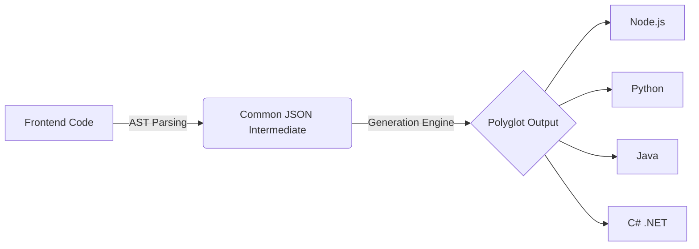

# 🚀 Create Backlist

[](https://www.npmjs.com/package/create-backlist)
[](https://www.npmjs.com/package/create-backlist)
[](https://opensource.org/licenses/MIT)

> **The World's First Polyglot Backend Generator using AST Analysis.**

Tired of manually creating backend boilerplate? **`create-backlist`** is an intelligent CLI tool that **Reverse Engineers** your frontend code to automatically generate a production-ready backend.

Unlike traditional scaffolders, it scans your `fetch` / `axios` calls using **Abstract Syntax Trees (AST)** and builds a custom backend with **Docker support** in seconds.

---

## 🏗️ How It Works (The Architecture)

`create-backlist` doesn't just copy-paste templates. It understands your code logic using a **3-Step Process**:



1. **Scan:** Reads frontend API calls (Axios/Fetch).
2. **Bridge:** Converts logic into a universal **JSON Intermediate Representation**.
3. **Generate:** Compiles that JSON into the target language (Node, Python, Java, or C#).

---

## ✨ Key Features

* **🤖 AST-Powered Analysis:** Scans your frontend codebase (React, Vue, etc.) to detect API endpoints automatically.
* **🌐 Polyglot Engine (Multi-Language):** Generate a backend in your preferred stack.
* ✅ **Node.js** (TypeScript & Express) - *Production Ready*
* 🚀 **Python** (FastAPI) - *Beta Support*
* ☕ **Java** (Spring Boot) - *Beta Support*
* 🔷 **C#** (ASP.NET Core) - *Beta Support*


* **🐳 Auto-Dockerization:** Automatically generates `Dockerfile` and `docker-compose.yml` for instant deployment.
* **🧠 Active Context Analysis:** Missed an endpoint? Just keep the file open in VS Code, and the tool will prioritize scanning your active window.
* **⚡️ Zero-Configuration:** A single command handles everything from project scaffolding to dependency installation.

---

## 📦 Installation & Usage

No global installation needed! Just run this command inside your existing frontend project's root directory:

```bash
npx create-backlist@latest

```

The tool will guide you through an interactive setup:

1. **Select your Target Language:** (Node.js, Python, Java, or C#)
2. **Enter a name for your backend directory:** (default: `backend`)
3. **Sit back and watch the magic!** 🪄

---

## 💡 Why `create-backlist`?

| Feature | Traditional Generators | 🚀 Create Backlist |
| --- | --- | --- |
| **Method** | Static Templates (Copy-Paste) | **Dynamic AST Analysis** |
| **Input** | User Inputs Manual Config | **Scans Existing Frontend Code** |
| **Language** | Single Language Only | **4+ Languages (Polyglot)** |
| **Docker** | Manual Setup | **Auto-Generated** |

---

## 🗺️ Roadmap

We are actively improving the engine to reach Enterprise Standards (v10 goal).

* [x] **Multi-Language Support (JS, Python, Java, C#)**
* [x] **Docker Support**
* [ ] **Database ORM Generation:** Automatically create Prisma/TypeORM schemas based on request bodies.
* [ ] **Authentication Boilerplate:** Auto-generate JWT auth flows.
* [ ] **Cloud Deployment Scripts:** AWS/Azure setup scripts.

---

## 🛠️ Contributing

We welcome contributions! Especially if you are an expert in Java or C#, help us move those generators from **Beta** to **Production Ready**.

1. Fork the Project
2. Create your Feature Branch (`git checkout -b feature/AmazingFeature`)
3. Commit your Changes (`git commit -m 'Add some AmazingFeature'`)
4. Push to the Branch (`git push origin feature/AmazingFeature`)
5. Open a Pull Request

## 📄 License

This project is licensed under the MIT License.

---

*Built with ❤️ by [W.A.H. ISHAN](https://github.com/WAH-ISHAN).*

```

